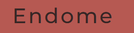
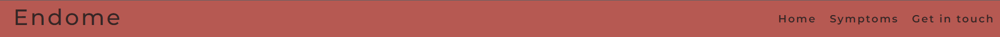

# ENDOME

[Am I responsive](https://ui.dev/amiresponsive?url=https://alejandrajimenez07.github.io/Endome-project/)  
[Live site](https://alejandrajimenez07.github.io/Endome-project/)

## UX

### Colour Scheme

The colours used in this project are base on the logo, which I made myself taking inspiration on a uterus image that is attached on the logo.

- `B65952` used for the header, nav bar and footer.
- `#C66963` used for main containers.
- `#E9E0E1` used for body background.
- `#362625` used for all text in the website.
- `#E6CACA` used for get in touch container's background.

Example:

I used [coolors.co](https://coolors.co/user/palettes/646a10d8da6879000b379175) to generate my colour palette.

### Typography 

#### Fonts

- [Montserrat](https://fonts.google.com/specimen/Montserrat) was used for all text on the website, it is a popular font for web design as it has high readability for the user.

## Wireframes

I've used [Balsamiq](https://balsamiq.com/wireframes) to design my site wireframes.

### Home Page Wireframes

| Size | Screenshot |
| --- | --- |
| Mobile |  |
| Tablet |  |
| Desktop |  |

## Features

### Existing Features

- **Header:**

    - This is the header and logo of the website it is designed according to the Endometriosis diseases called 'Endome', making it easy to remember and identify for the user.
    - The header has a hover animation with a background color of #E6CACA.
 

- **Navigation bar:**

    - This it is designed to provide the user with easy navigation across all three pages, the header incluides the navigation bar at right hand corner, the logo is located at the left hand corner which has been center to create balance on the bar.
    -  The navigation bar provides a more accessible way to navigate thorough 'Home', 'Symptoms', and 'Get in touch' pages.
    - The navigation bar also has a hover with the same background as the header.
    - I added space lettering to both header and nav bar to make it easier to read.

    

   - When the screens is smaller than 640px 'home' page does not display this is with the purpose of having a more clean nav bar on smallers screens.
   
   
   Phone view
   
- **Home Page Hero Image Session:**

    - The home page contains a hero image with the logo, two headers with one parapagrah each and 4 containers with the stages of Endometriosis. Link can be found in [here](https://www.canva.com/design/DAFjGMIlZ5k/RosBMMaDAe1xsxmLJkwPpg/view?utm_content=DAFjGMIlZ5k&utm_campaign=celebratory_first_publish&utm_medium=link&utm_source=celebratory_first_publish)
    -  This page was build with nude colors, providing the user a more relax and warm atmosphere.
      **Logo:**
    
    **Home page image:**
    
    (Home page image)
    
    

- **About Endome and Endometriosis session:**

  - The section contains two header and two paragraphs.
  - What is Endome section explains what is endome's organisation and what is the purpose of the website.
  - What is Endometriosis section contains information explaining what the disease consist of and it gives clear information to the user that wants to know more about it. 

- **Stages section:**
  - This section containes information about the different stages of Endometriosis helping the user to identify the stage they might be on.
  - Each stage container contains a link where they can have more information with detailed explanation of each stage. The website can be found [here](https://www.endofound.org/stages-of-endometriosis).

- **Footer:**
  -The footer is located at the bottom of all three pages and it has the same background color as the header, that gives consistency on the design.
  -Footer contains the 'endome copyright 2023' and icons with social media links that will take you to external link. (Social media link does not diverts the users to real social media accounts).
  

- **Symptoms page:**
  - At Symptoms page you will find three headers each one with one paragraph briefing each section and a list underneath.
  - On symptoms section you can have information regarding endometriosis's symptoms, it gives a little brief about each symptom and how it can affect on daily life. I have also created 3 containers with different background to keep the consistency of the design and also make it easy to identify each list.
  - Symptoms brief paragraph contains a [link](https://www.mayoclinic.org/diseases-conditions/endometriosis/symptoms-causes/syc-20354656) where the user can find more details information about each symtom and more.
  
- **Treatments section**
  - The second section follows the same scheme. First a brief explanation, followed by a list.
   - The list the different treatment that people can get to try and easy the condition.
   - Within the brief paragraph you will also found a [link](https://www.nhs.uk/conditions/endometriosis/) with more detail information about each treatment.
- **Tips section:**
  - Tips is aligned with treatments section, I strongly believe that looks better in a row instead of columns as the information of treatment is also related to tips.
  - The tips's list contains some tips that the user will benefit from as this will help to ease the condition...
  - The paragraph also contains a external [link](https://www.healthline.com/health/endometriosis/living-with-endometriosis) with more useful tips for the user.

- **Get in touch page**
   - Get in touch contains a header with a paragraph inviting the user to fill up our contact page.
   
   - **Contact form:** Here you will find a contact form to fill up, first and last name are not required  but email is.
   - It also has two check box for the user to subscribe and also request to be contacted.
   - It has a 'Submit' button that is clickeable and it takes you to our 'thank you page'.
   
   - **Contact hero image:** I also added an image that gives freedom and relief vibes, this will make the user feel that they can trust us and this website is a place where they can feel secure and more confident with the information provided.
   - The image also flows with the colors palette scheme and I think it blends with the desire design.
   

- **Thank you page:**
  - Thank you page is the page where the user will be taking once the submit the form.
  - The style of the page is very simple. It contains the main header and a little text, wrapped in a pale pink container.
  - Thank you page has a redirection of 10 seconds that takes the user to the home page.
   

### Future Features

- **'Causes' on Home page:**
    - In the future I will like to add another container bellow stages, briefing about the possible causes of Endometriosis.
- **Expand all the information's containers:**
    - I will also like to expand the containers with more detailed information of the info that already exists.
- **When to see a GP:**
    - Will add a 'When to see a GP' container with information that can help the user to decide when they should consult their GP.

## Tools & Technologies Used
- [HTML](https://en.wikipedia.org/wiki/HTML) used for the main site content.
- [CSS](https://en.wikipedia.org/wiki/CSS) used for the main site design and layout.
- [CSS Flexbox](https://www.w3schools.com/css/css3_flexbox.asp) used for an enhanced responsive layout.
- [Git](https://git-scm.com) used for version control. (`git add`, `git commit`, `git push`)
- [GitHub](https://github.com) used for secure online code storage.
- [GitHub Pages](https://pages.github.com) used for hosting the deployed front-end site.
- [Gitpod](https://gitpod.io) used as a cloud-based IDE for development.

## Testing

The site has been tested by friends and family on a variety of mobile devices (IOS-Android)(Chrome, Opera, Safari) and all links and the contact form functioned as it should. All input fields of the contact form function correctly, and require the requested input field (Email Address) before submitting.

## Deployment

The site was deployed to GitHub Pages. The steps to deploy are as follows:
- In the [GitHub repository](https://github.com/Alejandrajimenez07/Endome-project), navigate to the Settings tab 
- From the source section drop-down menu, select the **Main** Branch, then click "Save".
- The page will be automatically refreshed with a detailed ribbon display to indicate the successful deployment.

The live link can be found [here](https://alejandrajimenez07.github.io/Endome-project/)

### Local Deployment

This project can be cloned or forked in order to make a local copy on your own system.

#### Cloning

You can clone the repository by following these steps:

1. Go to the [GitHub repository](https://github.com/Alejandrajimenez07/Endome-project) 
2. Locate the Code button above the list of files and click it 
3. Select if you prefer to clone using HTTPS, SSH, or GitHub CLI and click the copy button to copy the URL to your clipboard
4. Open Git Bash or Terminal
5. Change the current working directory to the one where you want the cloned directory
6. In your IDE Terminal, type the following command to clone my repository:
	- `git clone https://github.com/Alejandrajimenez07/Endome-project`
7. Press Enter to create your local clone.

Alternatively, if using Gitpod, you can click below to create your own workspace using this repository.

Please note that in order to directly open the project in Gitpod, you need to have the browser extension installed.
A tutorial on how to do that can be found [here](https://www.gitpod.io/docs/configure/user-settings/browser-extension).

#### Forking

By forking the GitHub Repository, we make a copy of the original repository on our GitHub account to view and/or make changes without affecting the original owner's repository.
You can fork this repository by using the following steps:

1. Log in to GitHub and locate the [GitHub Repository](https://github.com/Alejandrajimenez07/Endome-project)
2. At the top of the Repository (not top of page) just above the "Settings" Button on the menu, locate the "Fork" Button.
3. Once clicked, you should now have a copy of the original repository in your own GitHub account!

### Local VS Deployment

I could not find any differences between the local and deployment version.

## Credits

I have faced many challenges with this project, particuraly as I was affected on my ability to learn and focus due some personal issues I had while I was doing the course. 

I want to thank to Iris_ci Cohort Facilitator and Student Care from Code Institute for supporting me through the journey by giving me advise and specially encouring me to continue with this journey.

As start I have took inspiration from 'Love running project' for the header, nav bar and footer.

**For further HTML and CSS issues I encountered these sites have been used for reference:**
  - I played this [game](flexboxfroggy.com) to help to understand how to flex box works.
  - I have also watched this [video](https://www.youtube.com/watch?v=tXIhdp5R7sc) and this [video](https://www.youtube.com/watch?v=18VLSXfsj94&t=915s) to help to understand more and also choose if i wanted to use grid or flex box. Which the first video was sent by Martina and the second I did found it myself in youtube.
  - I have research on [w3school](https://www.w3schools.com/CSSref/sel_hover.php) to remind how to apply hover effect
  - I have visit this [website](https://webdesign.tutsplus.com/articles/flexbox-vs-css-grid-which-should-you-use--cms-30184) to learn more about layouts.
  - I have also watched several videos from this [youtube](https://www.youtube.com/playlist?list=PLZlA0Gpn_vH9xx-RRVNG187ETT2ekWFsq) chanel called 'Web Dev simplified' it has a lot of videos that helps to understand better web development for beginners and to find potencial solutions in any issue I faced. (I have attached the link for the list of videos I have watched).
  - I have also used this two Readme files https://github.com/CarinaAJ/p1-aurora-borealis/blob/main/README.md#credits and https://github.com/CluelessBiker/project1-la-lucha/blob/main/README.md#features that was send by Martina to help me to understand how to make it and also use it as a guide/inspiration to write this document.
  - I borrowed the folloring code from W3school for the contact [form](https://www.w3schools.com/tags/tryit.asp?filename=tryhtml5_input_type_submit) and have also borrow another peace of [code](https://www.w3schools.com/csS/css3_buttons.asp) to style the 'submit' button.

### Content

| Source | Location | Notes |
| --- | --- | --- |
| [Markdown Builder](https://traveltimn.github.io/markdown-builder) | README and TESTING | tool to help generate the Markdown files |
| [freeCodeCamp](https://www.freecodecamp.org/news/a-beginners-guide-to-git-how-to-write-a-good-commit-message/) | version control | "How to Write a Git Commit Message" |
| [W3Schools](https://www.w3schools.com/howto/howto_js_topnav_responsive.asp) | entire site | responsive HTML/CSS/JS navbar |
| [Flexbox Froggy](https://flexboxfroggy.com/) | entire site | modern responsive layouts |
| [YouTube](https://www.youtube.com/watch?v=1PnVor36_40) | youtube channel | Learn CSS in 20 minutes |
| [YouTube](https://www.youtube.com/watch?v=8JJ101D3knE) | youtube video | Git Tutorial for Beginners |
| [Canva](https://strftime.org) | Logo maker | Website to create free logos |

### Media

| Source | Location | Type | Notes |
| --- | --- | --- | --- |
| [canva](https://www.canva.com/design/DAFjGMIlZ5k/RosBMMaDAe1xsxmLJkwPpg/view?utm_content=DAFjGMIlZ5k&utm_campaign=celebratory_first_publish&utm_medium=link&utm_source=celebratory_first_publish ) | home page | image | Logo of the website |
| [Pexels](https://www.pexels.com/photo/woman-in-yellow-dress-standing-on-pink-petaled-flower-field-1146242/) | contact page | image | image for contact page |

### Acknowledgements

- I would like to thank my Code Institute mentor, [Martina](https://github.com/TravelTimN) for their support throughout the development of this project and for helping through the course, sending me tutorials and useful tips to implement on my project and specially for guiding me in the project. She also gave me very useful advise and she always encouraged me to keep going and always believed on me.

- I would like to thank the [Code Institute Slack community](https://code-institute-room.slack.com) for the moral support; it kept me going during periods of self doubt and imposter syndrome.
- I would like to thank my partner (John/Jane), for believing in me, and allowing me to make this transition into software development.
- I would like to thank my employer, for supporting me in my career development change towards becoming a software developer.

- Least but not less I want to thank [Jonathan](https://github.com/Jonathan97-web/) for being such of nice person, give me loads of support and helping me through the whole course journey, he always explained and replied any question I had very patiently in the most easiest possible way for me to understand, giving me examples, sending me videos, tutorials and games to help me understand better. He also did help me to find solutions with problems I faced on the project specially with the CSS positioning... Jonathan thanks a lot for everything you done for me, this course and project would not been as great as it is without your help!